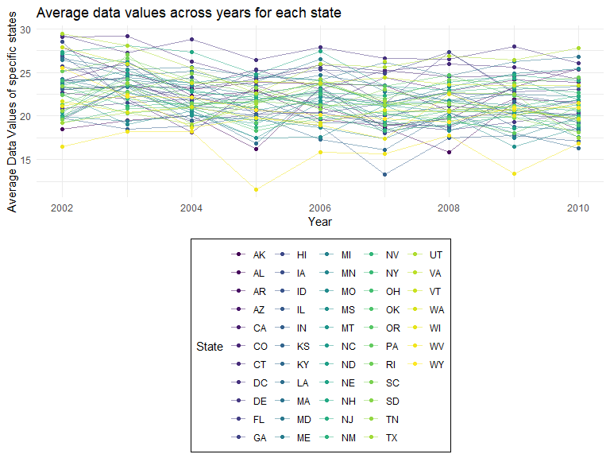
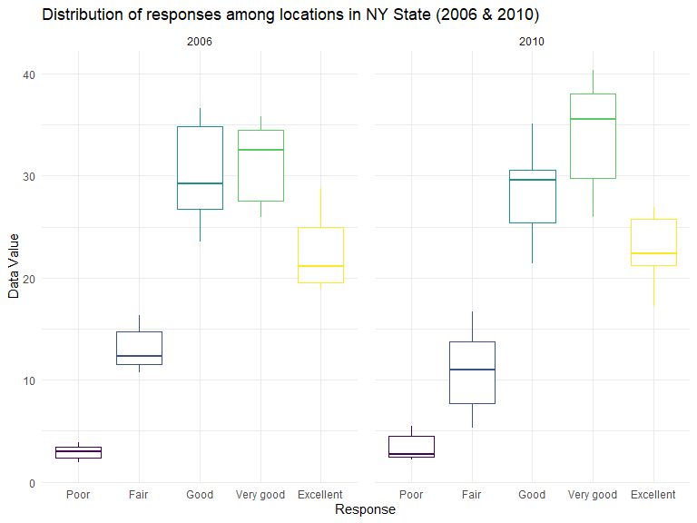

p8105_hw3_bh2852
================
Beicheng Huang
2023-10-14

### Problem 1

#### Read in the data

``` r
data("instacart")

instacart = 
  instacart |> 
  as_tibble()
```

#### Answer questions about the data

This dataset contains 1384617 rows and 15 columns, with each row
resprenting a single product from an instacart order. Variables include
identifiers for user, order, and product; the order in which each
product was added to the cart. There are several order-level variables,
describing the day and time of the order, and number of days since prior
order. Then there are several item-specific variables, describing the
product name (e.g. Yogurt, Avocado), department (e.g. dairy and eggs,
produce), and aisle (e.g. yogurt, fresh fruits), and whether the item
has been ordered by this user in the past. In total, there are 39123
products found in 131209 orders from 131209 distinct users.

Below is a table summarizing the number of items ordered from aisle. In
total, there are 134 aisles, with fresh vegetables and fresh fruits
holding the most items ordered by far.

``` r
instacart |> 
  count(aisle) |> 
  arrange(desc(n))
```

    ## # A tibble: 134 × 2
    ##    aisle                              n
    ##    <chr>                          <int>
    ##  1 fresh vegetables              150609
    ##  2 fresh fruits                  150473
    ##  3 packaged vegetables fruits     78493
    ##  4 yogurt                         55240
    ##  5 packaged cheese                41699
    ##  6 water seltzer sparkling water  36617
    ##  7 milk                           32644
    ##  8 chips pretzels                 31269
    ##  9 soy lactosefree                26240
    ## 10 bread                          23635
    ## # ℹ 124 more rows

Next is a plot that shows the number of items ordered in each aisle.
Here, aisles are ordered by ascending number of items.

``` r
instacart |> 
  count(aisle) |> 
  filter(n > 10000) |> 
  mutate(aisle = fct_reorder(aisle, n)) |> 
  ggplot(aes(x = aisle, y = n)) + 
  geom_point() + 
  labs(title = "Number of items ordered in each aisle") +
  theme(axis.text.x = element_text(angle = 60, hjust = 1))
```


Our next table shows the three most popular items in aisles
`baking ingredients`, `dog food care`, and `packaged vegetables fruits`,
and includes the number of times each item is ordered in your table.

``` r
instacart |> 
  filter(aisle %in% c("baking ingredients", "dog food care", "packaged vegetables fruits")) |>
  group_by(aisle) |> 
  count(product_name) |> 
  mutate(rank = min_rank(desc(n))) |> 
  filter(rank < 4) |> 
  arrange(desc(n)) |>
  knitr::kable()
```

| aisle                      | product_name                                  |    n | rank |
|:---------------------------|:----------------------------------------------|-----:|-----:|
| packaged vegetables fruits | Organic Baby Spinach                          | 9784 |    1 |
| packaged vegetables fruits | Organic Raspberries                           | 5546 |    2 |
| packaged vegetables fruits | Organic Blueberries                           | 4966 |    3 |
| baking ingredients         | Light Brown Sugar                             |  499 |    1 |
| baking ingredients         | Pure Baking Soda                              |  387 |    2 |
| baking ingredients         | Cane Sugar                                    |  336 |    3 |
| dog food care              | Snack Sticks Chicken & Rice Recipe Dog Treats |   30 |    1 |
| dog food care              | Organix Chicken & Brown Rice Recipe           |   28 |    2 |
| dog food care              | Small Dog Biscuits                            |   26 |    3 |

Finally is a table showing the mean hour of the day at which Pink Lady
Apples and Coffee Ice Cream are ordered on each day of the week. This
table has been formatted in an untidy manner for human readers. Pink
Lady Apples are generally purchased slightly earlier in the day than
Coffee Ice Cream, with the exception of day 5.

``` r
instacart |>
  filter(product_name %in% c("Pink Lady Apples", "Coffee Ice Cream")) |>
  group_by(product_name, order_dow) |>
  summarize(mean_hour = mean(order_hour_of_day)) |>
  pivot_wider(
    names_from = order_dow, 
    values_from = mean_hour) |>
  knitr::kable(digits = 2)
```

    ## `summarise()` has grouped output by 'product_name'. You can override using the
    ## `.groups` argument.

| product_name     |     0 |     1 |     2 |     3 |     4 |     5 |     6 |
|:-----------------|------:|------:|------:|------:|------:|------:|------:|
| Coffee Ice Cream | 13.77 | 14.32 | 15.38 | 15.32 | 15.22 | 12.26 | 13.83 |
| Pink Lady Apples | 13.44 | 11.36 | 11.70 | 14.25 | 11.55 | 12.78 | 11.94 |

\##Q2

``` r
library(p8105.datasets)
data("brfss_smart2010")

brfss = brfss_smart2010 |>
  janitor::clean_names() |> 
  rename("State" = locationabbr) |>
  rename("County" = locationdesc) |>
  filter(response %in% c("Excellent", "Very good", "Good", "Fair", "Poor"), topic == "Overall Health") |> 
  mutate(response = factor(response, 
                           levels = c( "Poor", "Fair","Good", "Very good", "Excellent", ordered = TRUE)))
```

In 2002, which states were observed at 7 or more locations? What about
in 2010?

``` r
brfss |> 
  filter(year == 2002) |> 
  group_by(State) |> 
  summarise(location_N = n_distinct(County)) |> 
  filter(location_N >= 7)
```

    ## # A tibble: 6 × 2
    ##   State location_N
    ##   <chr>      <int>
    ## 1 CT             7
    ## 2 FL             7
    ## 3 MA             8
    ## 4 NC             7
    ## 5 NJ             8
    ## 6 PA            10

``` r
brfss |> 
  filter(year == 2010) |> 
  group_by(State) |> 
  summarise(location_N = n_distinct(County)) |> 
  filter(location_N >= 7)
```

    ## # A tibble: 14 × 2
    ##    State location_N
    ##    <chr>      <int>
    ##  1 CA            12
    ##  2 CO             7
    ##  3 FL            41
    ##  4 MA             9
    ##  5 MD            12
    ##  6 NC            12
    ##  7 NE            10
    ##  8 NJ            19
    ##  9 NY             9
    ## 10 OH             8
    ## 11 PA             7
    ## 12 SC             7
    ## 13 TX            16
    ## 14 WA            10

In 2002, CT, FL, MA, NC, NJ, PA were observed in 7 or more locations. In
2010, CA, CO, FL, MA, MD,NC,NE,NJ,NY,OH were observed in 7 or more
locations.

Construct a dataset that is limited to Excellent responses, and
contains, year, state, and a variable that averages the data_value
across locations within a state. Make a “spaghetti” plot of this average
value over time within a state.

``` r
excellent_only = 
  brfss |> 
  filter(response == "Excellent") |>
  group_by(year, State) |> 
  summarise(data_value_avg = mean(data_value))
```

    ## `summarise()` has grouped output by 'year'. You can override using the
    ## `.groups` argument.

``` r
# plot:
excellent_only |> 
  ggplot(aes(x = year, y = data_value_avg, color = State)) + 
  geom_line(alpha = .5) +
  geom_point() + 
  labs(x = "Year", 
       y = "Average Data Values of specific states", 
       title = "Average data values across years for each state") + 
  theme(legend.position = "bottom",
        legend.box.background = element_rect())
```


The new dataset called “Excellent_only” contains 3 variables (year,
State, and data_value_avg) and 443 observations in total.

The “plot” shows the distribution of average data values of states
across the years.

Make a two-panel plot showing, for the years 2006, and 2010,
distribution of data_value for responses (“Poor” to “Excellent”) among
locations in NY State.

``` r
brfss |> 
  filter(year %in% c(2006, 2010), State == "NY") |> 
  ggplot(aes(x = response, y = data_value, color = response)) +
  geom_boxplot() + 
  facet_wrap(~year) + 
  labs(x = "Response", 
       y = "Data Value",
       title = "Distribution of responses among locations in NY State (2006 & 2010)") + 
  theme(legend.position = "none",
        panel.spacing = unit(1, "lines"))
```


Both 2006 and 2010 data distribution across states show a relative
normal distribution with slightly right skewed distribution towards
Excellentce. For both plots, Poor responses has the smallest data value
while in 2006 Good responses has the largest data value and in 2o10 the
very good responses has the most data values.

\##Q3

``` r
nhanes_covar = 
  read_csv(file = "nhanes_covar.csv",
           skip = 4) |> 
  janitor::clean_names() |> 
  filter(age >= 21) |> 
  drop_na()
```

    ## Rows: 250 Columns: 5
    ## ── Column specification ────────────────────────────────────────────────────────
    ## Delimiter: ","
    ## dbl (5): SEQN, sex, age, BMI, education
    ## 
    ## ℹ Use `spec()` to retrieve the full column specification for this data.
    ## ℹ Specify the column types or set `show_col_types = FALSE` to quiet this message.

``` r
nhanes_accel = 
  read_csv(file = "nhanes_accel.csv") |> 
  janitor::clean_names()
```

    ## Rows: 250 Columns: 1441
    ## ── Column specification ────────────────────────────────────────────────────────
    ## Delimiter: ","
    ## dbl (1441): SEQN, min1, min2, min3, min4, min5, min6, min7, min8, min9, min1...
    ## 
    ## ℹ Use `spec()` to retrieve the full column specification for this data.
    ## ℹ Specify the column types or set `show_col_types = FALSE` to quiet this message.

``` r
nhanes_merge = 
  inner_join(nhanes_covar, nhanes_accel, by = "seqn")
```

``` r
nhanes_merge$sex = factor(nhanes_merge$sex, 
                    levels = c("1", "2"),
                    labels = c("Male", "Female"))

nhanes_merge$education = factor(nhanes_merge$education, 
                          levels = c("1", "2", "3"),
                          labels = c("Less than High School", "High School Equivalent", "More than High School"))

nhanes_merge$seqn = as.integer(nhanes_merge$seqn)
nhanes_merge$age = as.integer(nhanes_merge$age)
```

``` r
nhanes_merge |> 
  group_by(sex, education) |> 
  summarize(count = n()) |> 
  pivot_wider(names_from = education, values_from = count) |> 
  knitr::kable(digits = 1)
```

    ## `summarise()` has grouped output by 'sex'. You can override using the `.groups`
    ## argument.

| sex    | Less than High School | High School Equivalent | More than High School |
|:-------|----------------------:|-----------------------:|----------------------:|
| Male   |                    27 |                     35 |                    56 |
| Female |                    28 |                     23 |                    59 |

For Less than high school, there are 27 male and 28 female. High school
equivalent education has 35 male and 23 female. For more than high
school education, there are 56 male and 59 female.

``` r
nhanes_merge |> 
  ggplot(aes(x = education, y = age, fill = sex)) +
  geom_boxplot(alpha = 0.50) +
  labs(x = "Education level",
       y = "Age",
       title = "Male and Female Age Distribution in Each Education Category")
```


According to the boxplot, for education “Less than high school”, the age
distribution for male and female are roughly the same. For education
level “High school equivalent”, the mean age distribution for male is
younger than that of female. For education level “More than high
school”, the age distribution for male and female are roughly the same
with female having a slightly younger mean age.

``` r
# create new variable
nhanes_total <-
  nhanes_merge |> 
    mutate(total_activity = rowSums(across(min1:min1440), na.rm = TRUE))

# make plots
nhanes_total |> 
ggplot(aes(x = age, y = total_activity, color = sex)) + 
  geom_point(alpha = 0.5, size = 1.5) + 
  geom_smooth(method = lm, se = FALSE) + 
  facet_wrap(~education) + 
  labs(x = "Age",
       y = "Total Activity each day (min)",
       title = "Total Minutes of Activity in a Day for Different Education Level (Male vs Female)") +
  theme(panel.spacing = unit(1, "lines"))
```

    ## `geom_smooth()` using formula = 'y ~ x'


According to the plot, no matter what education you are, the total
activity each day is reduced as age increased for men and women.
Moreover, for high school equivalent education and higher, female have
longer total activity time than men across age.

``` r
nhanes_final <-
  nhanes_merge |> 
  pivot_longer(cols = starts_with("min"), 
               names_to = "minute",
               values_to = "activity") |> 
  mutate(minute = as.integer(gsub("min", "", minute)))

nhanes_final |> 
  ggplot(aes(x = minute, y = activity, color = sex)) +
  geom_line(alpha = 0.5) + 
  geom_smooth(aes(group = sex), se = FALSE) + 
  facet_wrap(~education) + 
  labs(x = "Min",
        y = "Activity (min)",
       title = "24-hour Activity by Education Level for Male and Female")
```

    ## `geom_smooth()` using method = 'gam' and formula = 'y ~ s(x, bs = "cs")'


According to the 24Hour activity graph, we can observe that the general
activity trends in minutes are similar no matter education level and
sex. All graphs show that there’s lowest activity level around 250
minutes past 0h (midnight), and apart from the “less than high
education” group, the other two educuation level demonstrate a higher
activity trend for female in general.
